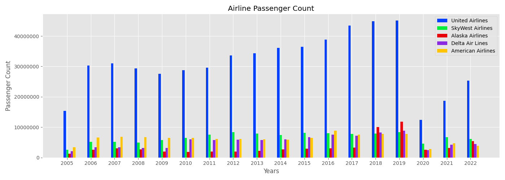

## Matplotlib Step by Step Learning

Start Date: 23th Mar 2023

In this repo I will practice matplotlib step by step using Corey's Youtube tutorial https://www.youtube.com/watch?v=UO98lJQ3QGI&list=PL-osiE80TeTvipOqomVEeZ1HRrcEvtZB_

### Dataset

We will using San Francisco Airport Dataset for training. https://data.sfgov.org/Transportation/Air-Traffic-Passenger-Statistics/rkru-6vcg

### Simple Line plot

### Line plot with xkcd

### Side by Side Bar plot

### Horizontal Bar plot

### Time Series plot

Added Time Series Plot Notebook based on Climate Change dataset.

Added Time Series Plot with annotation.

Added Pie Chart Plot
